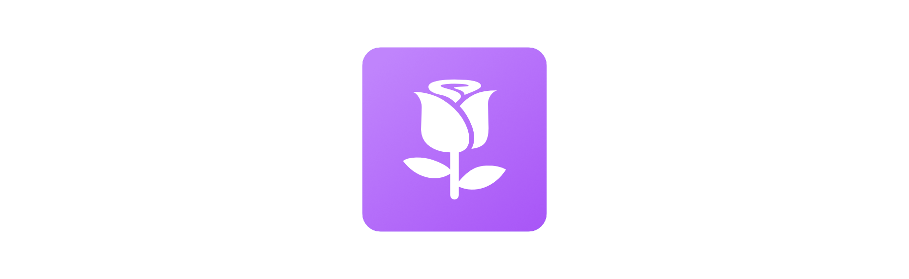
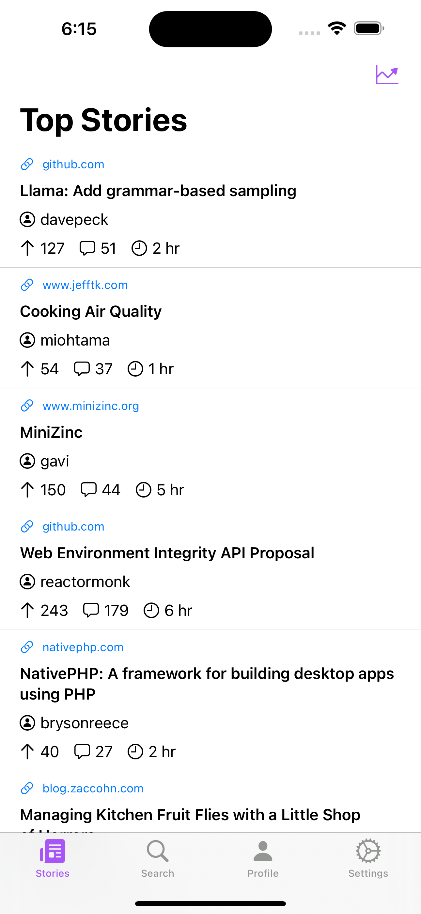
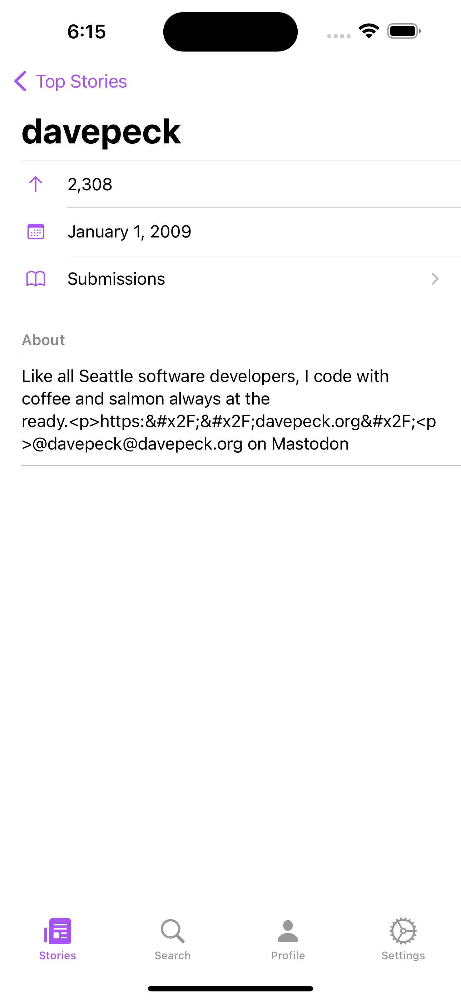

  

  An Apple-esque Hacker News client for iOS, iPadOS, and macOS.

   
   
  
  
  

## About

Ada (named for [Ada Lovelace, the first computer programmer](https://www.britannica.com/biography/Ada-Lovelace)) is a native iOS app to browse [Hacker News](https://news.ycombinator.com/).

With this app, you are able to browse the top, best, and new stories on Hacker News while also upvoting and commenting on stories².

[Check out our community on Lemmy!](https://lemm.ee/c/ada)

²Logging in, upvoting, and commenting is coming soon.

## Why?

There are *a lot* of Hacker News apps on the App Store. Despite this, I decided to build this and throw it into the sea of apps that do exactly the same thing.

This project is primarily a learning experience for me. I have always wanted to build iOS apps and this felt like a great opportunity to learn. However, I also want to build an app that people can use and enjoy. 

## Images

  

        
    
  

## Acknowledgments

- [Hacker News API](https://github.com/HackerNews/API)

### Open Source Packages

- [AlertToast](https://github.com/elai950/AlertToast)
- [CachedAsyncImage](https://github.com/lorenzofiamingo/swiftui-cached-async-image)

## Contributing

Contributions are always appreciated. If you have an idea on how to improve something or there is a feature I missed, by all means I am open to the help! 

## License

Ada is fully open-source and licensed under GPLv3. See [LICENSE](LICENSE) for details. 
